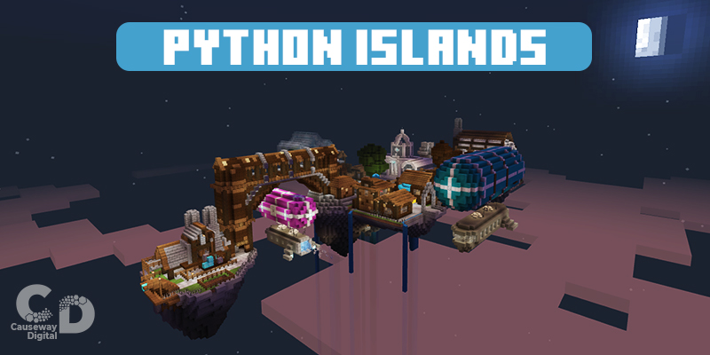

# Python Floating Islands

This repository contains the behaviour pack (bp) and resource pack for the Python Islands Minecraft Education Edition worlds.   
These 6 islands cover a full introduction to Python course, right up from inputs/outputs to lists and functions.   

The worlds can be downloaded from the links below
- [Island 1](https://education.minecraft.net/lessons/island-1)
- [Island 2](https://education.minecraft.net/lessons/island-2)
- [Island 3](https://education.minecraft.net/lessons/island-3)
- [Island 4](https://education.minecraft.net/lessons/island-4)
- [Island 5](https://education.minecraft.net/lessons/island-5)
- [Island 6](https://education.minecraft.net/lessons/island-6)
